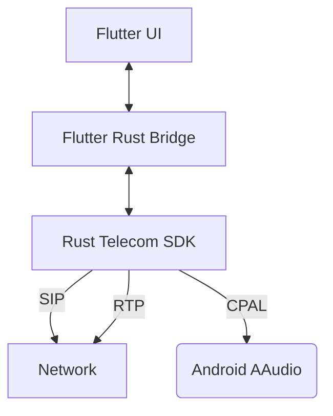

# 📱 Sentiric Sip UAC

[]()
[]()
[]()

**Sentiric Sip UAC**, Saha koşullarında (4G/5G, NAT arkası) telekomünikasyon altyapılarını (SBC, IMS, VoLTE) 
    stres, ses kalitesi (Raw Audio) ve mantık testlerine tabi tutmak için geliştirilmiş, 
    Flutter (UI) ve Rust (Core) tabanlı (mobile,linux,browser) uç (Edge) SIP istemcisi ve teşhis aracıdır.

Sıradan bir "Softphone" değildir; ağ gecikmesi, paket kaybı ve NAT davranışlarını analiz etmek için **"Raw Audio" (Ham Ses)** motoru üzerine kurulmuştur.

## 🌟 Temel Özellikler

*   **Hybrid Mimari:** UI işlemleri Flutter, tüm SIP/RTP ve Ses işlemleri Rust (`sentiric-telecom-client-sdk`) üzerinde çalışır.
*   **Self-Healing Audio:** Hoparlör/Ahize geçişlerinde veya Bluetooth kopmalarında ses akışını (RTP Stream) milisaniyeler içinde otomatik onarır.
*   **Digital Gain Booster:** Saha gürültüsünde duyulabilirliği artırmak için DSP seviyesinde dijital ses yükseltme (2.5x Gain).
*   **Smart NAT Traversal:** Simetrik NAT ve 4G/5G ağlarında sesin tek taraflı (one-way audio) kalmasını önleyen agresif RTP Latching.
*   **Detailed Telemetry:** SIP sinyalleşmesi ve RTP istatistikleri (RX/TX paket sayıları) ekranda anlık izlenir.

## 🏗️ Teknik Mimari



## ⚠️ Bilinen Sınırlamalar (Known Limitations)

Bu proje **Saha Test Aracı** olarak tasarlandığı için "Raw Audio" (Ham Ses) kullanır. Bu sebeple:

1.  **Hoparlör Yankısı (Speaker Echo):** Hoparlör moduna alındığında, cihazın donanımsal AEC (Acoustic Echo Cancellation) yetenekleri ham ses akışını (özellikle Gain uygulandığında) yakalamakta zorlanabilir. 
    *   *Öneri:* En iyi deneyim için **Ahize (Earpiece)** veya **Kulaklık** kullanın.
2.  **Arka Plan Gürültüsü:** Yazılımsal Gürültü Bastırma (Noise Suppression) devre dışıdır (Ses kalitesini ham haliyle test etmek için).

## 🚀 Kurulum ve Derleme

Proje `Makefile` ile tam otomatize edilmiştir.

### Ön Gereksinimler
*   Flutter SDK
*   Rust & Cargo
*   Android NDK
*   `cargo-ndk` ve `flutter_rust_bridge_codegen`

### Cihaza Yükleme (Production)

```bash
# SDK'yı güncelle, Rust kodunu derle, APK üret ve cihaza yükle
make deploy-device
```

## 🛠️ Geliştirici Notları

*   **Ses Motoru:** `cpal` kütüphanesi ile Android AAudio/OpenSL ES üzerinden düşük gecikmeli erişim sağlar.
*   **Loglama:** `adb logcat | grep SENTIRIC-MOBILE` komutu ile native katmandaki tüm detaylar izlenebilir.

---
© 2026 Sentiric Team | GNU AGPL-3.0 License

